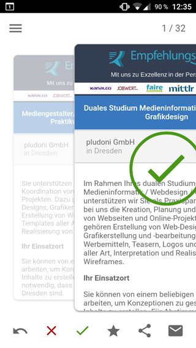

# empfehlungsbund-xamarin-forms

This Xamarin.Forms prototype is a mobile client for different job portals on [empfehlungsbund.de](https://www.empfehlungsbund.de) and was developed as part of my (German) diploma thesis on "[Evaluation and Prototype Implementation of a Mobile Application Using Modern Hybrid Frameworks](https://www.tyftler.com/evaluation-of-ionic-2-react-native-and-xamarin-forms/)".

This project is just for demonstration purposes and may not be executable since the API has changed and the secret keys have been removed.

For further information see [tyftler.com/evaluation-of-ionic-2-react-native-and-xamarin-forms](https://www.tyftler.com/evaluation-of-ionic-2-react-native-and-xamarin-forms/).
